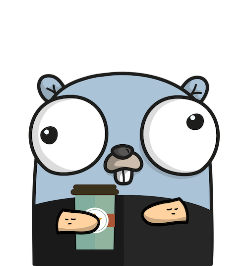

<a name="readme-top"></a>


# <p align="center"><b>Fast Food</b> <small>FIAP Tech Challenge 4 - Order Service</small></p>

<p align="center">
    
    
    
    
    
    
    
    
</p>


<p align="center">
    
</p>

## 💬 About

Repository for the [FIAP](https://postech.fiap.com.br/) Tech Challenge 4, focused on developing a microservice backend system for managing orders in a fast-food restaurant.

This service is composed of an `API` and a `Worker` that consumes messages from an AWS SQS queue.  
The API is responsible for handling HTTP requests, while the worker processes messages from the queue, such as order creation and updates.

Tech Challenge 4 specifications can be found [here](docs/tc4-spec.pdf).

> [!NOTE]
> Tech Challenge 1 repository can be found [here](https://github.com/FIAP-SOAT-G20/FIAP-TechChallenge-Fase1)  
> Tech Challenge 2 repository can be found [here](https://github.com/FIAP-SOAT-G20/FIAP-TechChallenge-Fase2)  
> Tech Challenge 3 repository can be found [here](https://github.com/FIAP-SOAT-G20/FIAP-TechChallenge-Fase3)  

## 🔗 Related Projects

This project is part of a larger system that includes:

- [Customer Service](https://github.com/FIAP-SOAT-G20/tc4-customer-service)
- [Payment Service](https://github.com/FIAP-SOAT-G20/tc4-payment-service)
- [Kitchen Service](https://github.com/FIAP-SOAT-G20/tc4-kitchen-service)
- [Infrastructure - Deploy (k8s)](https://github.com/FIAP-SOAT-G20/tc4-infrastructure-deploy)
- [Infrastructure -Terraform](https://github.com/FIAP-SOAT-G20/tc4-infrastructure-tf)


## 📚 Dictionary - Ubiquitous Language

- Customer (actor): Actor responsible for initiating the purchasing process
- Cook (actor): Actor responsible for preparing the customer's order
- Attendant (actor): Actor responsible for interacting with the customer, providing support for the order
- Identification method: Format in which the customer is identified on the platform: via CPF or anonymous.
- Identification: Customer identification on the platform
- Authorization: Grants permission to the customer to perform operations on the platform, such as placing an order, changing registration information
- Order: Represents all items selected by the customer in the store
- Order Status: Represents the stage of order preparation after payment is confirmed.

## 🏗️ Architecture

### Flow Diagram


### :open_file_folder: Project Structure

```sh
.
├── cmd
│   └── server
│   └── worker
│       └── consumer
├── docs
└──internal
    ├── adapter
    │   ├── controller
    │   ├── gateway
    │   └── presenter
    ├── core
    │   ├── domain
    │   │   ├── entity
    │   │   ├── value_object
    │   ├── port
    │   └── usecase
    └── infrastructure
        ├── config
        ├── database
        ├── datasource
        ├── handler
        ├── logger
        ├── middleware
        ├── route
        └── server
```

<details>
<summary>Project Structure Explanation</summary>

### **1️⃣ Core (Innermost layer)**

- `domain/`: Central business entities and rules.
- `dto/`: Data transfer objects.
- `port/`: Interfaces that define contracts between layers, ensuring independence.
- `usecase/`: Application use cases.

### **2️⃣ Adapter (Middle layer)**

- `controller/`: Coordinates the flow of data between use cases and infrastructure.
- `presenter/`: Formats data for presentation.
- `gateway/`: Implements access to data from external sources (databases, APIs, etc.).

### **3️⃣ Infrastructure (External layer)**

- `config/`: Application configuration management.
- `database/`: Configuration and connection to the database. 
- `datasource/`: Concrete implementations of data sources.
- `handler/`: Handling of HTTP requests.
- `httpclient/`: HTTP client for external requests.
- `logger/`: Structured logger for detailed logs.
- `middleware/`: HTTP middlewares for handling requests.
- `route/`: Definition of API routes.
- `server/`: Initialization of the HTTP server.
- `service/`: Infra level services.

</details>

### :bulb: Decisions

- **Clean Architecture structure**: The project was structured using the Clean Architecture pattern, which aims to separate the application into layers, making it easier to maintain and test. The project is divided into three layers: Core, Adapter, and Infrastructure.
- **Presenter**: The presenter (from Adapter layer) was created to format the data to be returned to the client. This layer is responsible for transforming the data into the desired format, such as JSON, XML, etc. Also, it is responsible for handling errors and returning the appropriate HTTP status code.
- **Use Case**: The use case (from Core layer) was created to define the business rules of the application. This layer is responsible for orchestrating the flow of data between the entities and the data sources.
- **Middleware to handle errors**: A middleware was created to handle errors and return the appropriate HTTP status code. This middleware is responsible for catching errors and returning the appropriate response to the client.
- **Structured Logger**: A structured logger was created to provide detailed logs. This logger is responsible for logging information about the application, such as requests, responses, errors, etc.
- **Database Connection**: The database connection was created using GORM, a popular ORM library for Go. This library provides an easy way to interact with the database and perform CRUD operations.
- **Database Migrations**: Database migrations were created to manage the database schema. This allows us to version control the database schema and apply changes to the database in a structured way.
- **HTTP Server**: The HTTP server was created using the Gin framework, a lightweight web framework for Go. This framework provides a fast and easy way to create web applications in Go.
- **Mock Payment Gateway**: A mock payment gateway was created with Mockoon (docker) to simulate the payment process. This mock server is used to test the payment process without interacting with the real payment gateway. We have tested the integration with the Mercado Pago API, but we are using the mock server to simulate the payment gateway validation, avoiding the need to expose the Mercado Pago API credentials, and to simplify the validation, because our mock server can access our webhook directly.

<p align="right">(<a href="#readme-top">back to top</a>)</p>

### ✨ Features

- [x] Dockerfile: small image with multi-stage docker build, and multi-platform build (Cross-Compilation)
- [x] Makefile: to simplify the build and run commands
- [x] Clean architecture
- [x] BDD (Gherkin/Godog)
- [x] Conventional commits

<details>
<summary>more</summary>

- [x] Unit tests (testify)
- [x] Tests Suite (testify)
- [x] Code coverage report (go tool cover)
- [x] Swagger documentation
- [x] Postman collection
- [x] Feature branch workflow
- [x] Live reload (air)
- [x] Pagination
- [x] Health Check (liveness, readiness)
- [x] Lint (golangci-lint)
- [x] Vulnerability check (govulncheck)
- [x] Mocks (gomock)
- [x] Environment variables
- [x] Graceful shutdown
- [x] GitHub Actions (CI/CD)
- [x] GitHub Container Registry (GHCR)
- [x] Structured logs (slog)
- [x] Database migrations (golang-migrate)
- [x] API versioning
- [x] C4 Model diagrams
- [x] Dev Container (VS Code)
- [x] Semantic Versioning
- [x] Golden Files
- [x] Fixtures

</details>

## :computer: Technologies

- [Go](https://golang.org/)
- [Gin Web Framework](https://gin-gonic.com/)
- [golangci-lint](https://golangci-lint.run/)
- [golang-migrate](https://github.com/golang-migrate/migrate)
- [govulncheck](https://pkg.go.dev/golang.org/x/vuln/cmd/govulncheck)

<details>
<summary>more</summary>

- [gomock](https://github.com/uber-go/mock)
- [go-playground/validator](https://github.com/go-playground/validator)
- [godotenv](https://github.com/joho/godotenv)
- [GORM](https://gorm.io/)
- [PostgreSQL](https://www.postgresql.org/)
- [Air](https://github.com/air-verse/air)
- [slog](https://pkg.go.dev/log/slog)
- [Docker](https://www.docker.com/)
- [Swagger](https://swagger.io/)
- [Make](https://www.gnu.org/software/make/)
- [Testify](https://github.com/stretchr/testify)
- [Godog](https://github.com/cucumber/godog)
- [Testcontainers](https://github.com/testcontainers/testcontainers-go)

</details>

## :scroll: Requirements

### Build/Run with Docker

- [Docker](https://www.docker.com/)

### Build/Run Locally (development)

- [Go](https://golang.org/)
- [Docker](https://www.docker.com/)

> [!WARNING]
> You need to have Go version **1.24 or higher** installed on your machine to run the application locally


<p align="right">(<a href="#readme-top">back to top</a>)</p>

## :cd: Installation

```sh
git clone https://github.com/FIAP-SOAT-G20/tc4-order-service
```

```sh
cd tc4-order-service
```

Set the environment variables

```sh
cp .env.example .env
```

### :whale: Docker

```sh
make compose-build
```

<p align="right">(<a href="#readme-top">back to top</a>)</p>

## :runner: Running

> [!TIP]
> We have created a step-by-step guide to test the application, you can find it [here](docs/validation-testing.md).  
>
> API Documentation will be available at:
>
> - Swagger:
>   - Docker: <http://localhost:8080/docs/index.html>
> - Postman collection: [here](docs/postman_collection.json)
> - [Rest Client](https://marketplace.visualstudio.com/items?itemName=humao.rest-client): [here](docs/requests.http)

### :whale: Docker

```sh
make compose-up
```

> [!TIP]
> To stop the application, run `compose-down`  
> To remove the application, run `compose-clean`  

> [!NOTE]
> The application will be available at <http://localhost:8080>
> Ex: <http://localhost:8080/api/v1/health>
> The worker will be ready to consume messages from the SQS queue, dont forget ro set AWS Credentials in the `~/.aws/credentials` file


<p align="right">(<a href="#readme-top">back to top</a>)</p>

## :hammer_and_wrench: Development

1. Install Go: https://golang.org/doc/install
2. Clone this repository: `git clone https://github.com/FIAP-SOAT-G20/fiap-tech-challenge-3-api`
3. Change to the project directory: `cd fiap-tech-challenge-3-api`
4. Checkout to the development branch: `make new-branch`
5. Set the environment variables: `cp .env.example .env`
6. Install dependencies by running `make install`
7. Run the application by running `make run-air` or `make run`
8. Access the application at `http://localhost:8080`
9. Make your changes 🧑‍💻
10. Dont forget to run the tests by running `make test`
11. Check the coverage report by running `make coverage`
12. Check the lint by running `make lint`
13. Update the swagger documentation by running `make swagger`
14. Commit your changes following the [Conventional Commits](https://www.conventionalcommits.org/en/v1.0.0/) standard
15. Push to the branch and Open a new PR by running `make pull-request`
16. The GitHub Actions will run the tests, lint and vulnerability check automatically
17. After the PR is approved, merge it to the main branch
18. Generate a new `release` tag ([here](https://github.com/FIAP-SOAT-G20/fiap-tech-challenge-3-api/releases/new)) with [semantic versioning](https://semver.org/)

> [!TIP]
> 7: `make run-api` will run the application locally, and will build and run PostgreSQL container using Docker Compose  
> Alternatively, you can run `make run-api-air` to run the application using Air (live reload)

> [!TIP]
> 18: When a new `release` tag is created, the GitHub Actions will build and push the image to the  
> GitHub Container Registry (GHCR) from GitHub Packages,  
> the images will be available at `ghcr.io/fiap-soat-g20/tc4-order-service-api:latest` and `ghcr.io/fiap-soat-g20/tc4-order-service-worker:latest`
> About semantic versioning:  
> if you are fixing bugs, increment the patch version (v0.0.1)  
> if you are adding new features, increment the minor version (v0.1.0)  
> if you are changing the API, increment the major version (v1.0.0)

<p align="right">(<a href="#readme-top">back to top</a>)</p>

## :white_check_mark: Tests

```sh
make test
```

> [!NOTE]
> It will run the unit tests and generate the coverage report as `coverage.out`  
> You can check the coverage report by running `make coverage`  

<p align="right">(<a href="#readme-top">back to top</a>)</p>

## :clap: Acknowledgments

- [Elegant use of GoLang channels with AWS SQS](https://marcioghiraldelli.medium.com/elegant-use-of-golang-channels-with-aws-sqs-dad20cd59f34)
- [Asynchronous tasks management made simple: AWS SQS with AWS Lambda](https://medium.com/canopas/asynchronous-tasks-management-made-simple-aws-sqs-with-aws-lambda-32959071c82d)
- [AWS SDK Code Examples](https://github.com/awsdocs/aws-doc-sdk-examples/blob/main/gov2/sqs/hello/hello.go)
- [Process AWS SQS Message With Goroutines](https://medium.com/@wiraizkandar/process-aws-sqs-message-with-goroutines-98ff4799ea69)
- [Amazon SQS examples using SDK for Go V2](https://docs.aws.amazon.com/code-library/latest/ug/go_2_sqs_code_examples.html)
- [Go with Cucumber: An Introduction for BDD Style Integration Testing](https://medium.com/tiket-com/go-with-cucumber-an-introduction-for-bdd-style-integration-testing-7aca2f2879e4)

<p align="right">(<a href="#readme-top">back to top</a>)</p>

## :busts_in_silhouette: Contributors

<div align="center">
  <table>
    <tbody>
      <tr>
        <td align="center" valign="top" width="14.28%"><a href="https://github.com/atomaz"><br /><sub><b>Alice Tomaz</b></sub></a><br />
        <td align="center" valign="top" width="14.28%"><a href="https://github.com/filipe1309"><br /><sub><b>Filipe Bonfim</b></sub></a><br />
        <td align="center" valign="top" width="14.28%"><a href="https://github.com/hugokishi"><br /><sub><b>Hugo Kishi</b></sub></a><br />
        <td align="center" valign="top" width="14.28%"><a href="https://github.com/marcos-nsantos"><br /><sub><b>Marcos Santos</b></sub></a><br />
        <td align="center" valign="top" width="14.28%"><a href="https://github.com/th3r4ven"><br /><sub><b>Matheus</b></sub></a><br />
      </tr>
    </tbody>
  </table>
</div>

<p align="right">(<a href="#readme-top">back to top</a>)</p>
